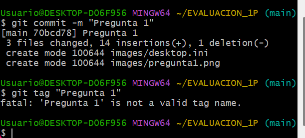
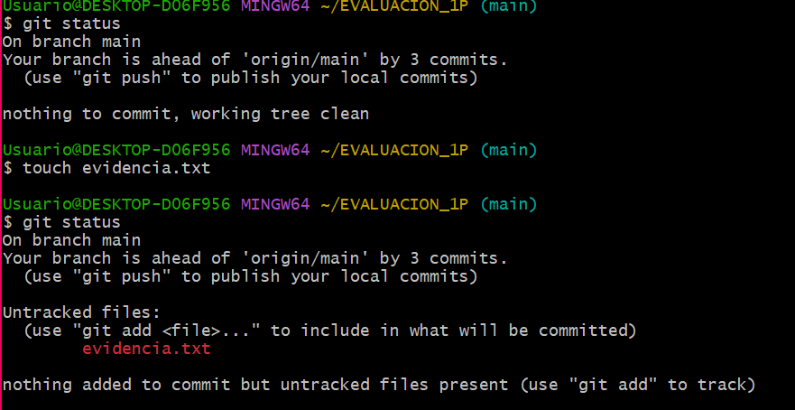
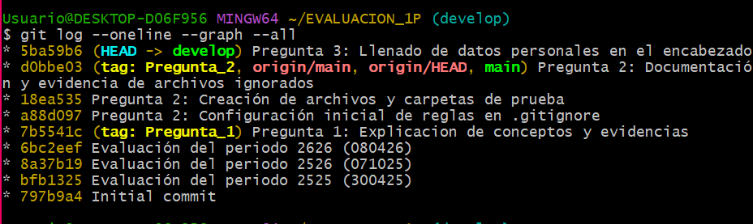

# Universidad Técnica de Ambato 
## Facultad de Ingenieria de Sistemas, Electrónica e Industrial  
### Carrera de Software  

**Asignatura:** Manejo y Configuración de Software  
**Nombre del Estudiante:** Gabriela Nuñez
**Fecha:** 08/04/2026 

---

# Evaluación Práctica de Git y GitHub

## Instrucciones Generales

- Cada pregunta debe ser respondida directamente en este archivo **(README.md)** debajo del enunciado correspondiente. 
- Es importante que se coloque capturas de pantalla como evidencia de la parte práctica. Se recomienda crear una carpeta `images/` para almacenar las capturas de pantalla.
- Cada respuesta debe ir acompañada de uno o más **commits**, según se indique en cada pregunta.
- Cuando se indique, deberán realizarse acciones prácticas dentro del repositorio (como creación de archivos, ramas, resolución de conflictos, etc.).
- Cada pregunta debe estar **etiquetada con un tag**, únicamente en el commit final correspondiente, con el formato: `"Pregunta 1"`, `"Pregunta 2"`, etc.

---

## Pregunta 1 (1 punto)

**Explicar la diferencia entre los siguientes conceptos/comandos en Git y GitHub:**

- `git clone`  
- `fork`  
- `git pull`

### Parte práctica:

- Realizar un **fork** de este repositorio en la cuenta personal de GitHub del estudiante.
- Luego, realizar un **clone** del fork en el equipo local.
- En este README, describir el proceso seguido:
  - ¿Cómo se realizó el fork?
  - ¿Cómo se realizó el clone del fork?
  - ¿Cómo se verificó que se estaba trabajando sobre el fork y no sobre el repositorio original?
- Realizar en la rama `main` todo lo que corresponde a esta pregunta.

**📝 Respuesta:**

### Diferencias Teóricas:
* **git clone:** Es el comando utilizado para descargar una copia local de un repositorio que ya existe en GitHub hacia nuestra computadora.
* **fork:** Es una funcionalidad propia de GitHub que crea una copia exacta de un repositorio ajeno en mi propia cuenta personal, permitiéndome editarlo sin afectar el original.
* **git pull:** Es el comando que descarga los cambios más recientes del repositorio remoto y los combina automáticamente con mi rama local actual.

### Proceso seguido en la práctica:
1. **¿Cómo se realizó el fork?** Entré al repositorio original del ingeniero y presioné el botón "Bifurcación" (Fork) en la esquina superior derecha, seleccionando mi perfil como destino.
2. **¿Cómo se realizó el clon del fork?** Copié la URL HTTPS de mi nuevo repositorio en GitHub y ejecuté el comando `git clone [URL]` en mi terminal local.
3. **¿Cómo se verificó el fork?** Ejecuté el comando `git remote -v` en la terminal, lo cual me mostró que las direcciones de descarga (fetch) y subida (push) apuntan a mi usuario de GitHub y no al del repositorio original.

**Evidencia de verificación:**

---

## Pregunta 2 (1 punto)

**Configurar un archivo `.gitignore` para que ignore:**

- Todos los archivos con extensión `.log`.
- Una carpeta llamada `temp/`.
- Todos los archivos `.md` y `.txt`de la carpeta `doc/`. (Probar agregando un archivo `prueba.md` y un archivo `prueba.txt` dentro de la carpeta y fuera de la carpeta.)

### Requisitos:

1. Realizar un **primer commit** que incluya únicamente el archivo `.gitignore` con las reglas de exclusión definidas.
2. Realizar un **segundo commit** que incluya las creación de los archivos de prueba.
2. Realizar un **tercer commit** donde se explique en este README la función del archivo `.gitignore` y se muestre evidencia de que los archivos y carpetas indicadas no están siendo rastreadas por Git.

**Importante:**  
- Solo el **tercer commit** debe llevar el **tag `"Pregunta 2"`**.

**📝 Respuesta:**

### Función del archivo .gitignore
El archivo `.gitignore` permite especificar patrones de nombres de archivos y carpetas que Git debe ignorar. Es fundamental para mantener el repositorio limpio de archivos temporales, logs de errores o datos sensibles.

**Evidencia de funcionamiento:**
Como se muestra en la captura de pantalla, al ejecutar `git status`, Git solo reconoce el archivo `evidencia.txt`, mientras que los archivos `.log` y las carpetas `temp/` y `doc/` son ignorados exitosamente.

---

## Pregunta 3 (2 puntos)

**Utilizar Git Flow para desarrollar una nueva funcionalidad llamada `ingresar-encabezado`.**

### Requisitos:

- Inicializar el repositorio con Git Flow, utilizando las ramas por defecto: `main` y `develop`.
- Crear una rama de tipo `feature` con el nombre `ingresar-encabezado`.
- En dicha rama, **completar con los datos personales del estudiante** el encabezado que ya se encuentra al inicio de este archivo `README.md`.
- Realizar al menos un commit durante el desarrollo.
- Finalizar el hotfix siguiendo el flujo de trabajo establecido por Git Flow.

### En la sección de respuesta, se debe incluir:

- Los **comandos exactos** utilizados desde la inicialización de Git Flow hasta el cierre de la rama.
- Una descripción del **proceso seguido**, indicando el propósito de cada paso.
- Una reflexión sobre las **ventajas de aplicar Git Flow**, especialmente en contextos colaborativos o proyectos de larga duración.

**Importante:**

- Deben realizarse varios commits durante esta pregunta.
- **Solo el commit final** debe llevar el **tag `"Pregunta 3"`**.
- El flujo debe respetar la estructura de Git Flow con las ramas `develop` y `main`.

**📝 Respuesta:**

### Comandos utilizados:
1. `git flow init`: Inicializa la estructura de ramas (main y develop).
2. `git flow feature start ingresar-encabezado`: Crea y se mueve a una rama específica para la tarea.
3. `git commit -m "..."`: Registra el avance de los datos personales.
4. `git flow feature finish ingresar-encabezado`: Fusiona la rama en `develop` y la elimina localmente.

### Descripción del proceso:
El proceso comenzó con la inicialización de Git Flow para establecer un orden jerárquico. Se trabajó en una rama aislada (`feature`) para no afectar el código estable mientras se editaba el encabezado con mis datos personales. Finalmente, se cerró la rama integrando los cambios en la rama de desarrollo (`develop`).

### Reflexión sobre Git Flow:
Git Flow es una metodología robusta que facilita la colaboración masiva. Sus ventajas principales son:
* **Orden:** Mantiene la rama `main` siempre limpia y lista para producción.
* **Paralelismo:** Permite que varios desarrolladores trabajen en distintas funciones simultáneamente sin interferir entre sí.
* **Trazabilidad:** Facilita la gestión de versiones y correcciones urgentes mediante ramas específicas de `hotfix` y `release`.
**Evidencia del flujo de trabajo (Git Flow):**
Se puede observar en el historial de commits cómo la rama `feature/ingresar-encabezado` nace de `develop` y se integra nuevamente tras completar la tarea.

---

## Pregunta 4 (2 puntos)

**Trabajo con Issues y Pull Requests**

### Parte teórica:

- ¿Qué es un Pull Request y cuál es su función dentro de un flujo de trabajo colaborativo con Git y GitHub?
- ¿Por qué es importante revisar un Pull Request antes de fusionarlo con la rama principal?
- ¿Qué tipo de observaciones o validaciones se suelen realizar durante la revisión de un Pull Request?

### Parte práctica:

- Trabajar en la rama `develop`, ya existente desde la configuración de Git Flow.
- Realizar los cambios necesarios en este archivo `README.md` para responder las preguntas.
- Realizar un **commit** con los cambios de la primera pregunta y subirlo a la rama `develop` del repositorio remoto.
- Crear un **pull request** desde `develop` hacia `main` en GitHub, con el nombre `"Pregunta 4 - Apellido Nombre"`.
- Crear comentarios solicitando: 1. que se agregue la respuesta de la segunda pregunta y luego agregando la respuesta con el respectivo commit; y 2. el mismo procedimiento para la tercera pregunta.
- **Aprobar** el pull request para que se haga el merge respectivo hacia `main`.

### En la sección de respuesta, se debe incluir:

- Un resumen del procedimiento realizado con las respectivas preguntas y capturas.
- El número y enlace al pull request.

### 📝 Respuesta Pregunta 4

#### Parte Teórica:
1. **¿Qué es un Pull Request (PR)?** Es una petición que hace un desarrollador para que sus cambios (ubicados en una rama como `develop`) sean revisados e integrados en otra rama (como `main`). Su función es facilitar la colaboración y el control de calidad.
2. **Importancia de la revisión:** Permite detectar errores antes de que lleguen a producción, asegura que el código siga los estándares del proyecto y facilita el intercambio de conocimientos entre el equipo.
3. **Validaciones comunes:** Se revisa la lógica del código, la legibilidad, que no rompa funcionalidades existentes, que cumpla con los requisitos del Issue y que la documentación esté actualizada.

#### Resumen del procedimiento práctico:
* Se trabajó sobre la rama `develop`.
* Se creó un Pull Request hacia `main` titulado "Pregunta 4 - Gabriela Nuñez".
* Se realizaron interacciones mediante comentarios para solicitar y agregar las respuestas faltantes.
* Finalmente, se aprobó el PR y se realizó el merge.

**Número de Pull Request:** #[Número de tu PR]
**Enlace:** [Pega aquí el enlace de tu PR en GitHub]

---

## Pregunta 5 (2 puntos)

**Resolver conflictos entre ramas y realizar un Pull Request**

### Requisitos:

- Crear dos ramas llamadas `ramaA` y `ramaB`, ambas a partir de la rama `develop`.
- En `ramaA`, crear un archivo llamado `archivoA.txt` con el contenido:  
  `Contenido A`
- En `ramaB`, crear un archivo con el mismo nombre (`archivoA.txt`), pero con el contenido:  
  `Contenido B`
- Intentar fusionar `ramaB` sobre `ramaA`, lo cual debe generar un conflicto.
- Resolver el conflicto combinando ambos contenidos.
- Realizar el merge de `ramaA` hacia `develop`.
- Crear un **pull request** desde `develop` hacia `main`.
- Una vez completado lo anterior, eliminar las ramas `ramaA` y `ramaB`.

### En la sección de respuesta, se debe incluir:

- El procedimiento completo:
  - Cómo se crearon las ramas.
  - Cómo se generó y resolvió el conflicto.
  - Cómo se realizó el merge hacia `develop`.
  - Cómo se eliminaron las ramas al finalizar.
- El enlace al pull request.
- Una breve explicación de qué es un conflicto en Git y por qué ocurrió en este caso.

**📝 Respuesta:**

<!-- Escribe aquí tu respuesta completa a la Pregunta 5 -->

---

## Pregunta 6 (2 puntos)

**Realizar limpieza, explicar versionamiento semántico y enviar cambios al repositorio original**

### Requisitos:

- Trabajar en la rama `develop` del fork del repositorio.
- Eliminar los archivos `archivoA.txt` y `archivoB.txt` creados en preguntas anteriores.
- Realizar un merge desde `develop` hacia `main` en el repositorio local.
- Enviar los cambios de la rama `main` local a la rama `develop` del repositorio remoto (fork). Recuerde incluir todos los tags creados (6 tags).
- Finalmente, crear un **pull request** desde la rama `develop` del fork hacia la rama `main` del repositorio original (del cual se realizó el fork en la Pregunta 1). El titulo del pull request debe ser `"NOMBRE APELLIDOS"`, en la descripción colocar el link de su repositorio de GitHub.

### En la sección de respuesta, se debe incluir:

- Una explicación del proceso realizado paso a paso.
- Una explicación del **versionamiento semántico**, indicando:
  - En qué consiste.
  - Sus tres componentes (MAJOR, MINOR, PATCH).
- Si hace falta agregar alguna evidencia adicional, agregue un tag adicional que sea `Version Final`.

**📝 Respuesta:**

<!-- Escribe aquí tu respuesta completa a la Pregunta 6 -->
